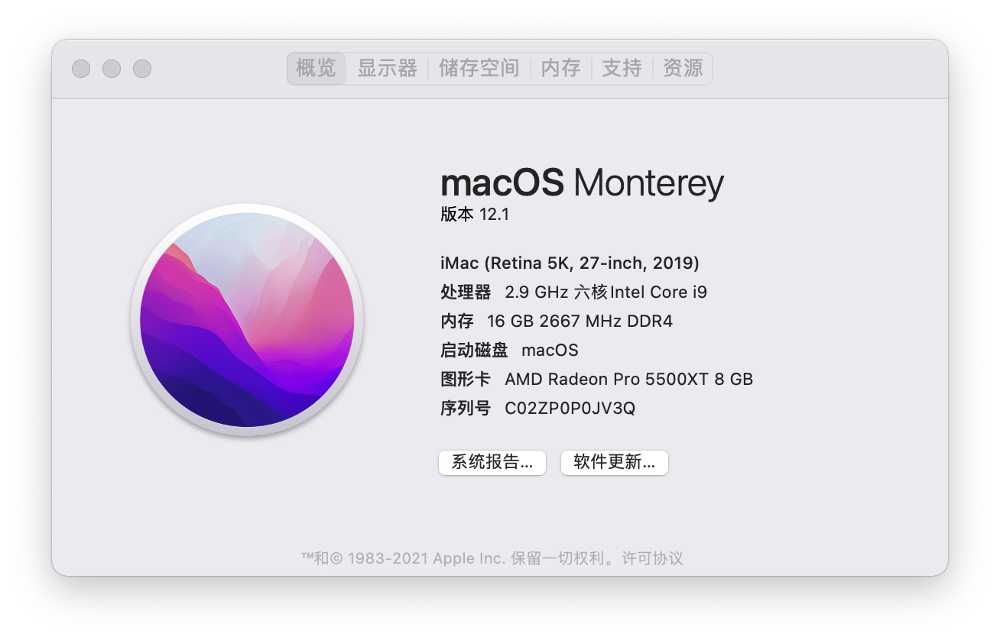
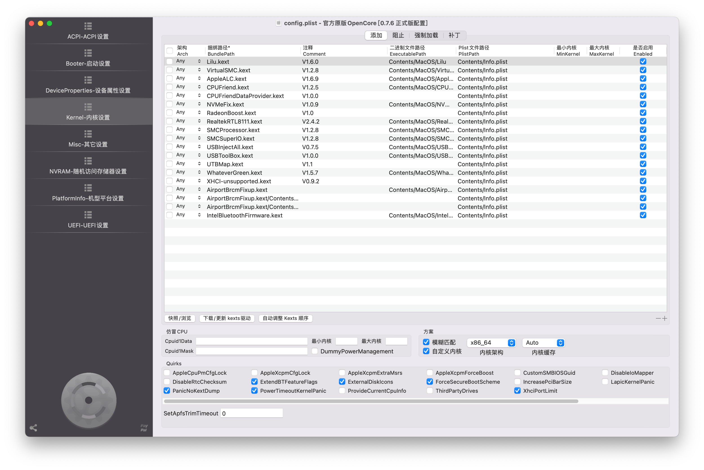
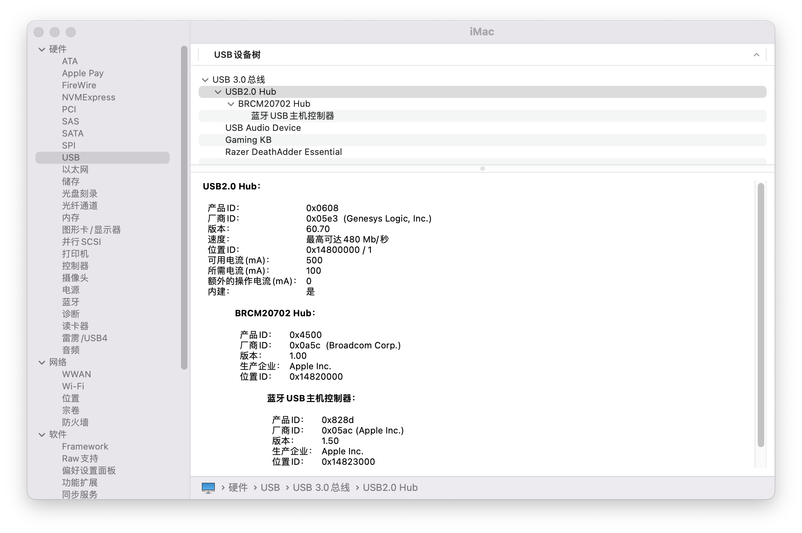
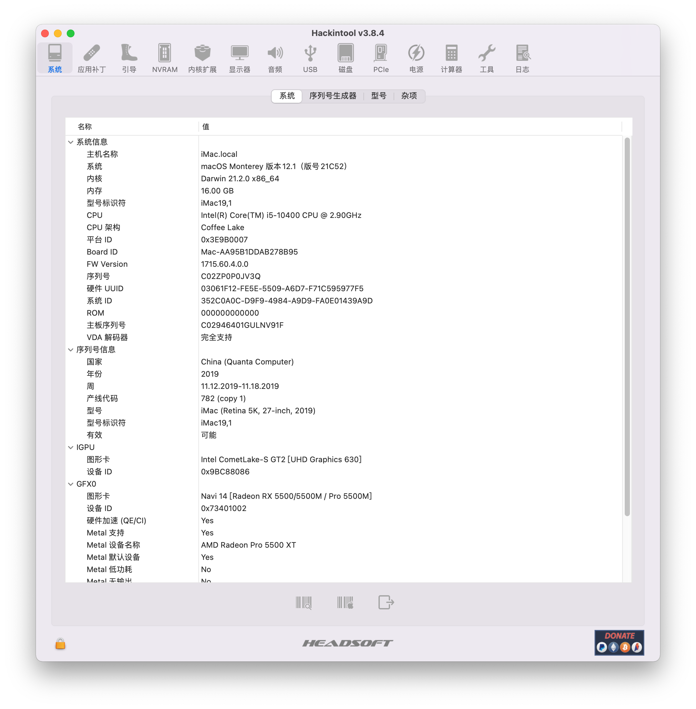
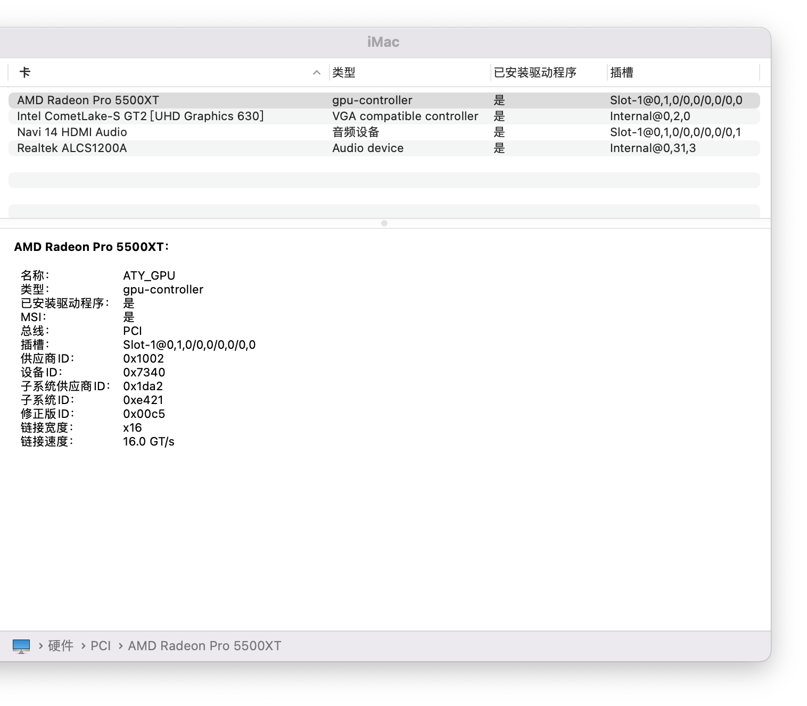
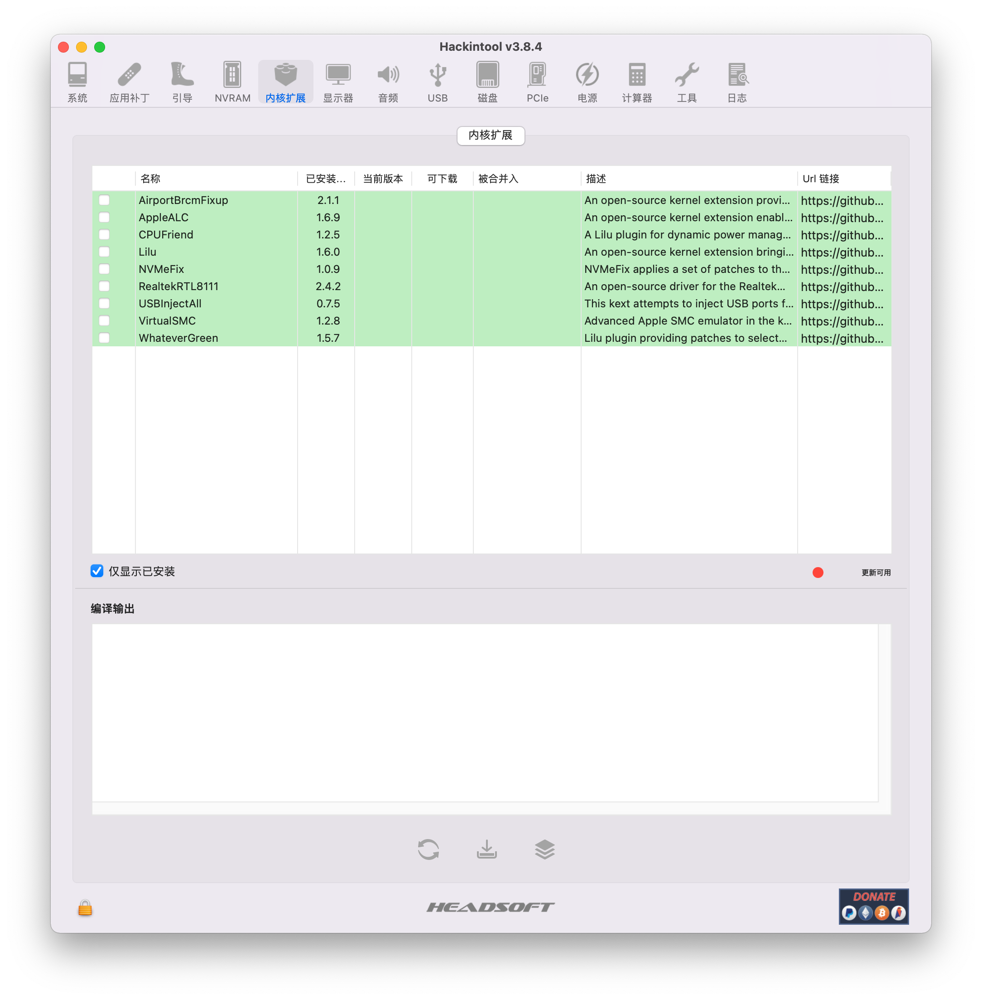
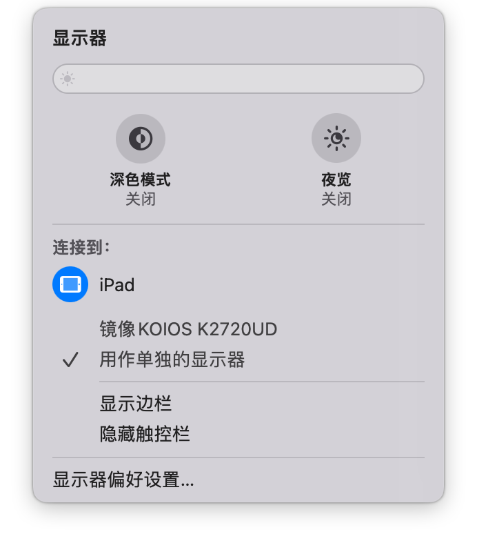
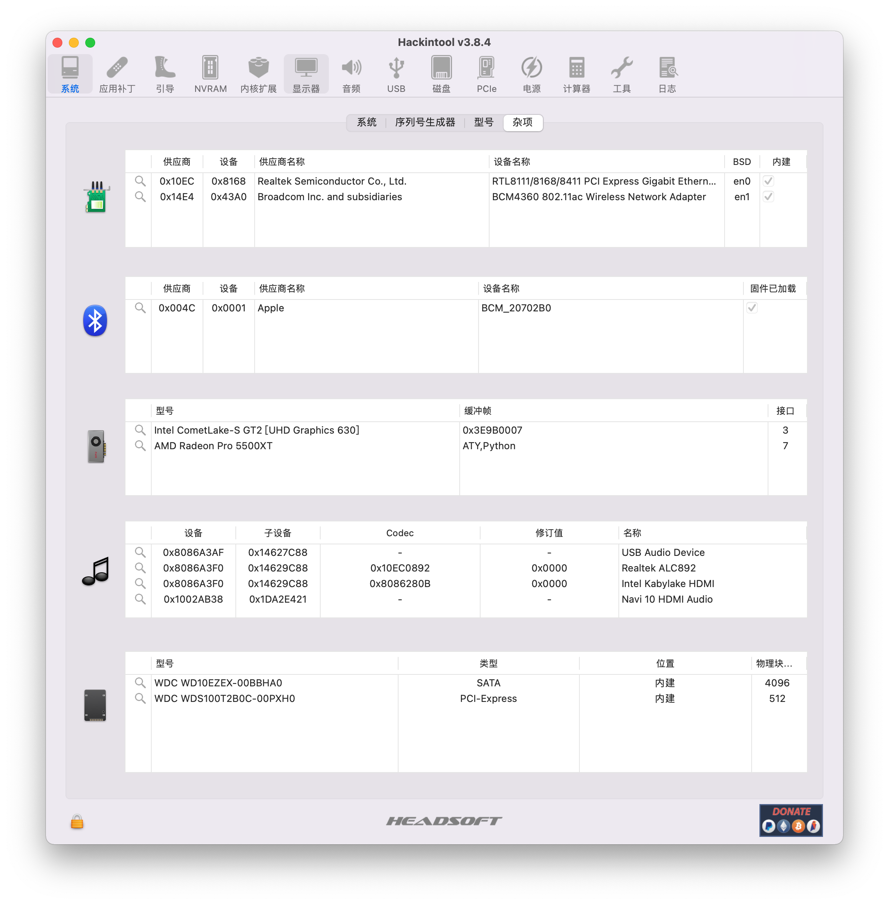

# msi b460 爆破版
>MAC版本:Monterey 12.1 21C52 
下载[Monterey 12.1 21C52](https://cloud.189.cn/web/share?code=FfiEVvqaeMni)
***
OpenCore版本:0.7.6
***
更新日期:2022-2-14
***
**配置清单:**

| 型号 | 类型            |
| ---- | --------------- |
| 主板 | 微星B460m爆破版 |
| 显卡 | 蓝宝石5500XT    |
| 网卡 | RealtekRTL8111  |

## 效果完美

> 显卡正常  
> 网卡正常
> 随航正常
> USB正常

